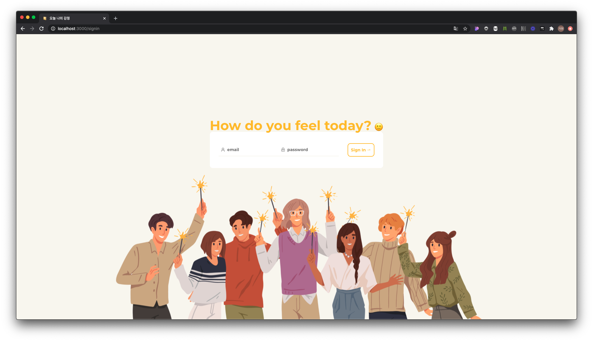
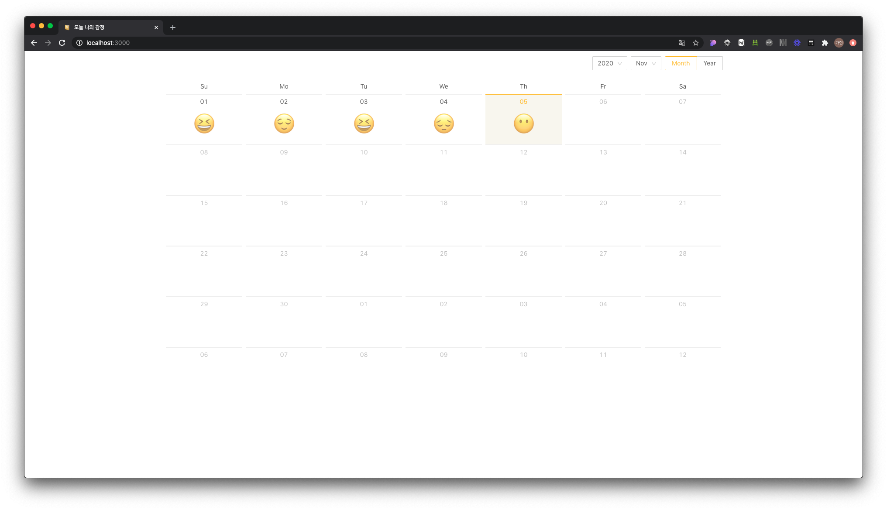

# 오늘 나의 감정

🏠 [HOMEPAGE]()
📹 [DEMO VIDEO](https://youtu.be/uzKeuc_Wg9k)

## 이모지를 활용한 일기 작성 웹 애플리케이션




## 개발 인원

FE 3명

- 유진혁 [@SaltPepperSalt](https://github.com/SaltPepperSalt)
- 김가현 [@tinkerbell93](https://github.com/tinkerbell93)
- 류동우 [@Detrox20](https://github.com/Detrox20)

## 적용기술

- HTML5
- SCSS
- JavaScript
- React
<details>
  <summary>라이브러리</summary>
  1. react-router-dom<br>
  2. react-redux<br>
  3. redux-saga<br>
  4. axios<br>
  5. antd<br>
  6. antd-icon<br>
  7. eslint-plugin-react-hooks@next<br>
  8. node-sass<br>
  9. error-boundary<br>
  10. devtools-extension<br>
  11. connected-react-router<br>
  </details>

## Getting Started

id: dbwlsgur24@daum.net
pw: fcschool16th

```code
$ git clone "https://github.com/tinkerbell93/React-Hackathon.git"
$ npm install
$ npm start
```
